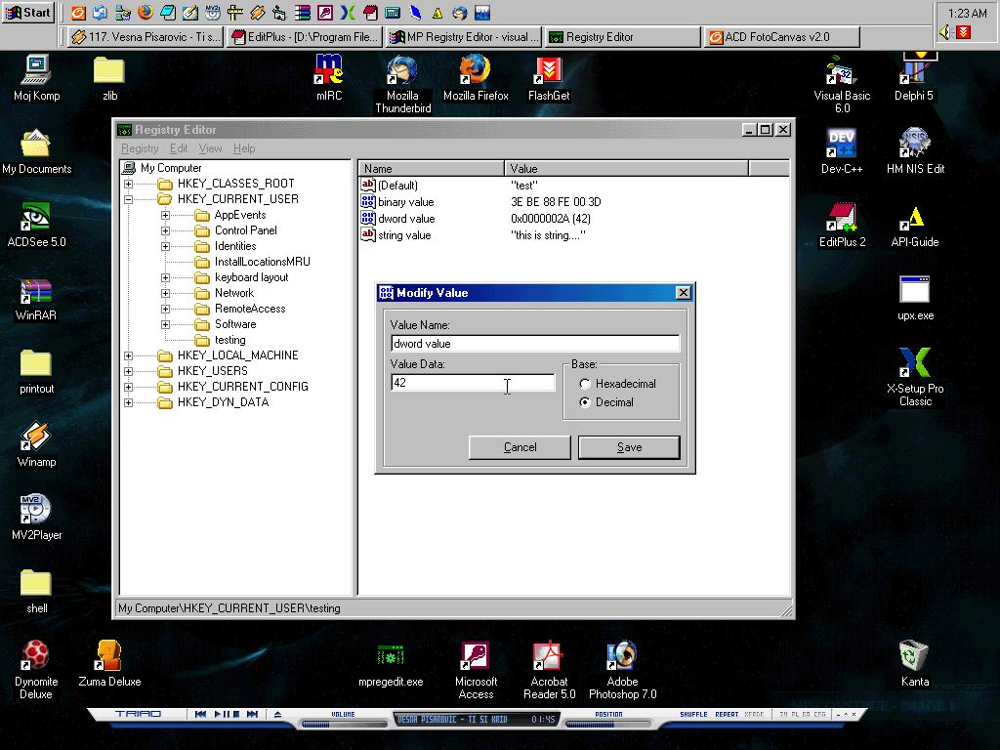



## MP Registry Editor

### Description

Fully suported Registry Editor written in VB that can handle all types (main) of registry values REG_SZ, REG_BINARY, REG_DWORD. Have all functions as regedit.exe

If you like the code plaes vote, cuz i spent some time on this! :D
 
### More Info
 

             |
---                |---
**Submitted On**   |2005-04-07 22:54:54
**By**             |[Aleksandar Ruzicic](https://github.com/Planet-Source-Code/PSCIndex/blob/master/ByAuthor/aleksandar-ruzicic.md)
**Level**          |Intermediate
**User Rating**    |5.0 (50 globes from 10 users)
**Compatibility**  |VB 6\.0
**Category**       |[Registry](https://github.com/Planet-Source-Code/PSCIndex/blob/master/ByCategory/registry__1-36.md)
**World**          |[Visual Basic](https://github.com/Planet-Source-Code/PSCIndex/blob/master/ByWorld/visual-basic.md)
**Archive File**   |[MP\_Registr187428482005\.zip](https://github.com/Planet-Source-Code/aleksandar-ruzicic-mp-registry-editor__1-59894/archive/master.zip)

